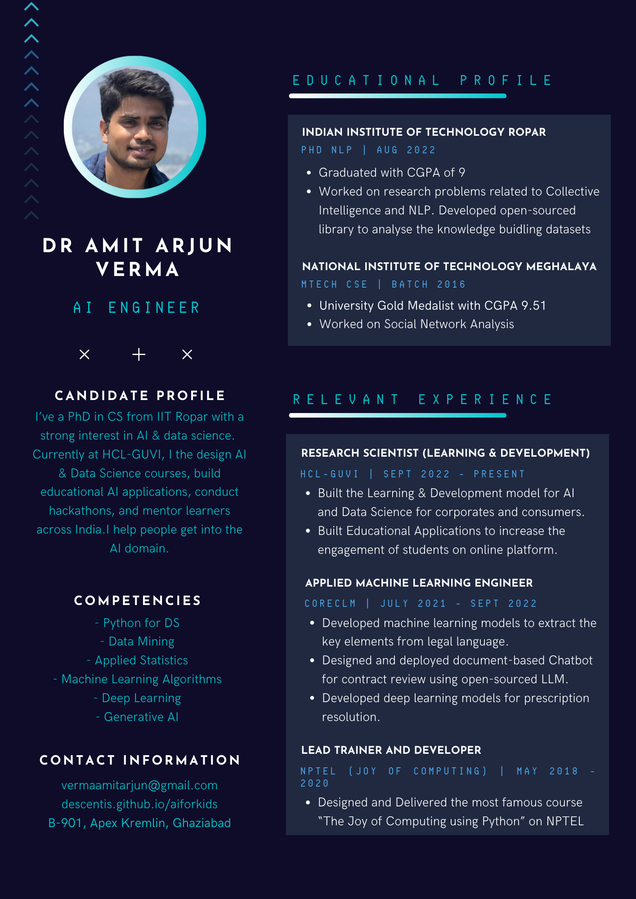

Hi! I'm Amit Arjun Verma. I’ve spent the last several years exploring how AI can solve real-world problems—whether it’s analysing Wikipedia data, helping computers understand legal contracts, or building learning tools for students.

I completed my PhD from IIT Ropar, worked in Seattle at CoreCLM on Legal NLP systems, and now lead Data Science and AI initiatives at HCL–GUVI. Over the years, I’ve taught and mentored thousands of learners across India.

I created DSI — Data Science Initiative because I believe every child should understand how AI works—not just use it. My goal is to make AI learning simple, creative, and exciting for school students.

{:class="img-responsive"}

